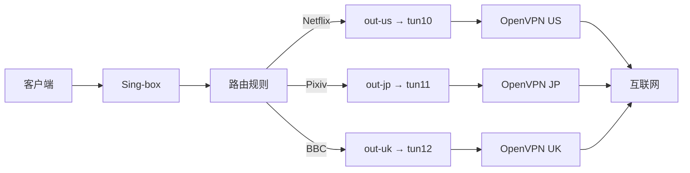

# OpenVPN Multi-Instance Manager

<div align="center">

**🌐 同时管理多个 OpenVPN 连接，为 Sing-box 提供多出口落地支持**

[](https://go.dev)
[](LICENSE)

[功能特性](#-功能特性) • [快速开始](#-快速开始) • [配置说明](#-配置说明) • [使用方法](#-使用方法) • [Sing-box 集成](#-sing-box-集成)

</div>

---

## 📖 项目简介

如果你购买了 ExpressVPN 或其他只提供 OpenVPN 配置的 VPN 服务，但想在 Sing-box 中使用多个出口节点，这个工具正是为你设计的！

本工具可以同时运行多个 OpenVPN 连接，每个连接创建独立的 TUN 网卡（如 `tun10`, `tun11`, `tun12`），然后在 Sing-box 中通过 `bind_interface` 字段绑定这些网卡，实现多出口负载均衡或分流。

### 🎯 使用场景

- ✅ 同时连接多个 OpenVPN 服务器
- ✅ 为每个连接创建独立的 TUN 设备
- ✅ 与 Sing-box 无缝集成，实现多出口分流
- ✅ 支持自动重启和健康检查
- ✅ 提供详细的状态监控

---

## ✨ 功能特性

- 🚀 **一键安装** - 提供自动化安装脚本
- 📦 **多实例管理** - 同时运行多个 OpenVPN 连接
- 🔧 **简单配置** - 使用 YAML 配置文件管理所有连接
- 🌐 **独立 TUN 设备** - 每个连接使用独立的网卡
- 📊 **状态监控** - 实时查看所有连接状态
- 🔄 **自动重启** - 连接断开时自动恢复
- 🎮 **命令行工具** - 简洁的 CLI 界面
- 🔗 **Sing-box 集成** - 完美配合 Sing-box 使用

---

## 📋 系统要求

- Linux 操作系统（Debian/Ubuntu/CentOS 等）
- Go 1.20 或更高版本
- OpenVPN 2.4+
- Root 权限（用于创建 TUN 设备）

---

## 🚀 一键安装

**超级简单！自动安装所有依赖！**

```bash
curl -sSL https://raw.githubusercontent.com/Cd1s/opv-mult/main/quick-install.sh | sudo bash
```

**这一行命令会自动完成：**
- ✅ 安装 Git（如需要）
- ✅ 克隆源码
- ✅ 安装 OpenVPN
- ✅ 安装 Go
- ✅ 下载依赖（已修复）
- ✅ 编译并安装
- ✅ **交互式配置向导**
- ✅ 可选即时启动

### 或者手动安装

```bash
# 克隆仓库
git clone https://github.com/Cd1s/opv-mult.git
cd opv-mult

# 运行安装脚本（自动安装依赖）
sudo bash install.sh
```

---

## ⚙️ 配置说明

### 方法一：使用交互式配置向导（推荐）

运行安装脚本时选择 "是" 进行配置：

```bash
sudo bash install.sh
```

向导会询问：
1. OpenVPN 配置文件路径（.ovpn 文件）
2. 是否需要用户名密码认证
3. 连接名称
4. TUN 设备名称
5. 是否立即启动

一切都会自动配置好！

### 方法二：手动配置

如果你想手动配置或添加多个连接：

#### 1. 准备 OpenVPN 配置文件

将你的 ExpressVPN 配置文件（`.ovpn` 文件）放到：

```bash
/etc/openvpn/configs/
```

### 2. 创建认证文件（如果需要）

如果你的 OpenVPN 需要用户名和密码：

```bash
# 创建认证文件
echo '你的用户名' > /etc/openvpn/auth/us-server.txt
echo '你的密码' >> /etc/openvpn/auth/us-server.txt
```

### 3. 编辑配置文件

编辑 `/etc/openvpn-manager/config.yaml`：

```yaml
log_level: info
log_file: /var/log/openvpn-manager.log

instances:
  # 美国服务器
  - name: us-server-1
    config: /etc/openvpn/configs/us-la-5.ovpn
    auth_file: /etc/openvpn/auth/us-server.txt
    tun_device: tun10
    enabled: true
    
  # 日本服务器
  - name: jp-server-1
    config: /etc/openvpn/configs/jp-tokyo-3.ovpn
    auth_file: /etc/openvpn/auth/jp-server.txt
    tun_device: tun11
    enabled: true
    
  # 英国服务器
  - name: uk-server-1
    config: /etc/openvpn/configs/uk-london-1.ovpn
    auth_file: /etc/openvpn/auth/uk-server.txt
    tun_device: tun12
    enabled: true
```

**配置项说明：**

| 字段 | 说明 | 必填 |
|------|------|------|
| `name` | 实例的唯一标识 | ✅ |
| `config` | OpenVPN 配置文件路径 | ✅ |
| `auth_file` | 认证文件路径（用户名密码） | ❌ |
| `tun_device` | TUN 设备名称（必须唯一） | ✅ |
| `enabled` | 是否启用此实例 | ✅ |

---

## 🎮 使用方法

### 启动所有连接

```bash
sudo openvpn-manager start
```

### 查看连接状态

```bash
sudo openvpn-manager status
```

输出示例：
```
OpenVPN Manager Status
======================

Instance: us-server-1
  Status:     running
  TUN Device: tun10
  IP Address: 10.8.0.6/24
  Uptime:     2h15m30s

Instance: jp-server-1
  Status:     running
  TUN Device: tun11
  IP Address: 10.9.0.5/24
  Uptime:     2h15m30s
```

### 列出可用的 TUN 设备

```bash
sudo openvpn-manager list
```

输出示例：
```
Available TUN Devices for Sing-box
===================================

tun10 -> us-server-1 (✓ Running) [10.8.0.6/24]
tun11 -> jp-server-1 (✓ Running) [10.9.0.5/24]
tun12 -> uk-server-1 (✓ Running) [10.7.0.3/24]

Sing-box 配置示例：
{
  "type": "direct",
  "tag": "out-us",
  "bind_interface": "tun10"
}
```

### 停止所有连接

```bash
sudo openvpn-manager stop
```

### 启用开机自启动

```bash
sudo systemctl enable openvpn-manager
sudo systemctl start openvpn-manager
```

---

## 🔗 Sing-box 集成

### 完整配置示例

在 Sing-box 配置中使用创建的 TUN 设备：

```json
{
  "log": {
    "level": "info"
  },
  "inbounds": [
    {
      "type": "mixed",
      "tag": "mixed-in",
      "listen": "127.0.0.1",
      "listen_port": 7890
    }
  ],
  "outbounds": [
    {
      "type": "direct",
      "tag": "out-us",
      "bind_interface": "tun10"
    },
    {
      "type": "direct",
      "tag": "out-jp",
      "bind_interface": "tun11"
    },
    {
      "type": "direct",
      "tag": "out-uk",
      "bind_interface": "tun12"
    },
    {
      "type": "direct",
      "tag": "direct"
    }
  ],
  "route": {
    "rules": [
      {
        "domain_suffix": [
          "netflix.com",
          "nflxvideo.net"
        ],
        "outbound": "out-us"
      },
      {
        "domain_suffix": [
          "pixiv.net",
          "dmm.com"
        ],
        "outbound": "out-jp"
      },
      {
        "domain_suffix": [
          "bbc.co.uk"
        ],
        "outbound": "out-uk"
      }
    ],
    "final": "direct"
  }
}
```

### 工作原理

1. **OpenVPN Manager** 启动多个 OpenVPN 连接
2. 每个连接创建独立的 TUN 设备（`tun10`, `tun11`, `tun12`）
3. **Sing-box** 通过 `bind_interface` 绑定这些 TUN 设备
4. 根据路由规则，不同的流量走不同的出口



---

## 📝 高级用法

### 手动编译

```bash
# 下载依赖
go mod download

# 编译
go build -o openvpn-manager main.go

# 运行
sudo ./openvpn-manager start
```

### 使用 Makefile

```bash
# 编译
make build

# 编译并安装
make install

# 清理
make clean
```

### 自定义配置文件路径

```bash
sudo openvpn-manager -c /path/to/config.yaml start
```

---

## 🔍 故障排除

### 问题：OpenVPN 启动失败

**解决方案：**
1. 检查配置文件路径是否正确
2. 检查认证文件格式（每行一个，用户名和密码）
3. 查看日志：`cat /var/log/openvpn-tun10.log`

### 问题：TUN 设备未创建

**解决方案：**
1. 确保以 root 权限运行
2. 检查 TUN 内核模块：`sudo modprobe tun`
3. 检查 OpenVPN 是否正常运行

### 问题：Sing-box 无法使用 TUN 设备

**解决方案：**
1. 确保 TUN 设备存在：`ip link show`
2. 确保 Sing-box 以 root 权限运行
3. 检查 `bind_interface` 名称是否正确

---

## 📄 许可证

本项目采用 MIT 许可证 - 详见 [LICENSE](LICENSE) 文件

---

## 🤝 贡献

欢迎提交 Issue 和 Pull Request！

---

## ⭐ Star History

如果这个项目对你有帮助，请给一个 Star ⭐

---

## 📧 联系方式

- GitHub Issues: [https://github.com/Cd1s/opv-mult/issues](https://github.com/Cd1s/opv-mult/issues)

---

<div align="center">

**使用愉快！Have Fun! 🎉**

</div>
